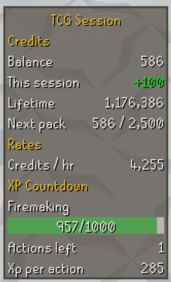
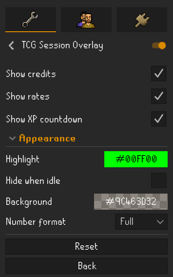

# TCG Session Overlay

Shows your OSRS TCG credit progress on screen while you play, so you can see what this session has
earned and how close you are to the next credits without opening a panel.

## What you need

The **OSRS TCG** plugin installed and logged in. This plugin reads the data OSRS TCG saves on your
computer and never writes to it, so nothing you do here can affect your collection or credits.

## What it shows

### Credits

**This session** is what you have earned since you logged in. It turns green once you earn anything.

### Rates

Credits earned per hour of actual training. Time spent doing nothing does not count, so going
to the bank or stepping away will not drag the number down. It shows `-` for the first minute.

### XP Countdown

How close you are to your next credit award, and roughly how many more actions it will take.
The estimate uses the middle value of your last ten XP drops, so it settles quickly and is not
thrown off by the occasional big one.

While training a combat skill it shows what your next level up is worth instead, because combat
XP does not earn credits.

## How credits are earned

| What you do | Credits |
| --- | --- |
| Every 1,000 XP in most skills | 100 |
| Every 100 Slayer XP | 10 |
| Attack, Strength, Defence, Ranged, Magic and Hitpoints XP | none |
| Levelling up any skill, combat included | 1,250 at low levels, rising to 25,000 at 99 |

## Settings

| Setting | What it does |
| --- | --- |
| Show credits | Turn the Credits section on or off |
| Show rates | Turn the Rates section on or off |
| Show XP countdown | Turn the XP Countdown section on or off |
| Highlight | The colour used once you have earned credits this session |
| Hide when idle | Hides the overlay after five minutes without XP, and brings it back on your next XP drop |
| Background | Panel colour. Drag the alpha slider left to make it more see through |
| Number format | `199,982` or `199.9K` |

Drag the overlay to move it and drag its edge to resize it, the same as any RuneLite overlay.

## Things worth knowing

**Your balance, packs and collection live in the OSRS TCG panel.** This overlay deliberately sticks
to what you earn while you play, which it works out from your live XP and can keep accurate.

**Session earnings only count what you earn here.** Credits that arrive from another device will
not be counted as this session's, so the number stays honest.

**The Slayer bar is approximate.** OSRS TCG does not save its Slayer progress, so the bar can be up
to 99 XP out. The credits it awards are still exact.

## Not affiliated

An independent, read only companion plugin. Not affiliated with, endorsed by, or connected to
OSRS TCG or its author.
